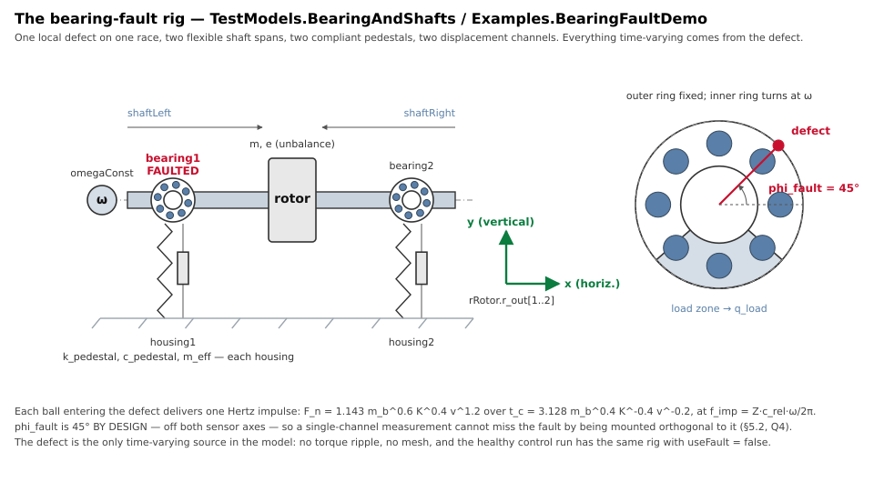
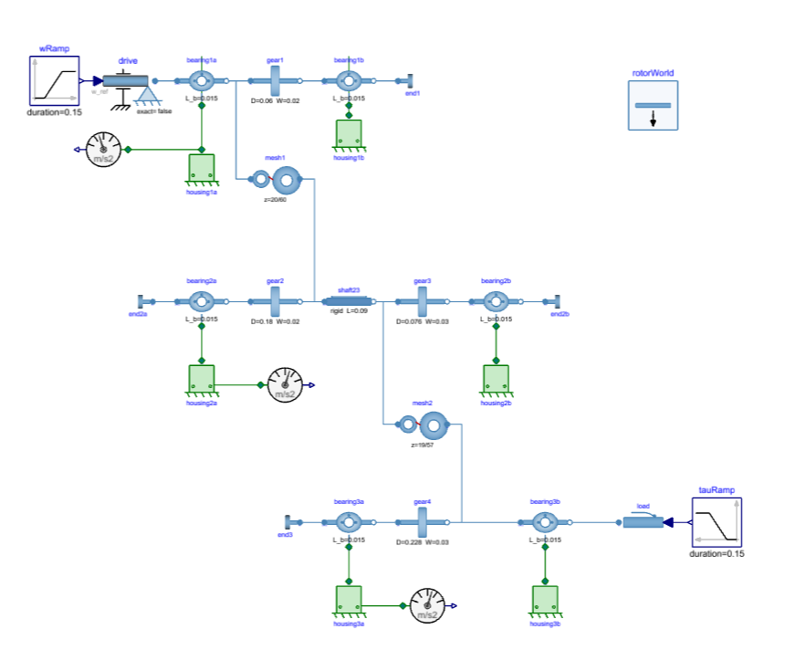

# Where the Evidence Lives: A Modelica Library Through the Credible Modeling Process

*This is Part 2 of a series on agentic AI in modeling and simulation. [Part 1](/blog/agentic-ai-when-checking-becomes-cheap/) ended on a question: if an AI built the model and an AI checked the model, why should anyone trust it? The answer has two legs, process and tooling. This part is about the process leg.*

### The Library, and What It Is For

The mission statement fits in one sentence: **the RotorDynamics library should be able to create credible synthetic data for fault detection in rotating machinery and gearboxes.**

The word carrying the weight there is *credible*. Synthetic fault data is easy to generate and easy to believe. A spectrum with a sideband family around the mesh frequency looks convincing whether or not the model that produced it has any right to that sideband spacing. If a diagnostic algorithm is trained on such data and then deployed on a real gearbox, the cost of the model having been wrong shows up much later, and somewhere else.

So the question is not whether the library runs. It is what anyone is entitled to conclude from what it produces, and on what evidence.

{.img-fluid style="max-width:75%"}

*The bearing-fault rig — `TestModels.BearingAndShafts` and `Examples.BearingFaultDemo`. A fault is a sequence of Hertz impulses injected where the rolling elements pass it; what the model has to get right is how that sequence reaches the accelerometer on the housing.*

### What the Credible Modeling Process Asks

The [Credible Modeling Process (CMP)](https://www.prostep.org/en/projects/smart-systems-engineering-smartse-gb) is the model-level tier of the CDP–CSP–CMP framework from prostep ivip's Smart Systems Engineering group (*Simulation Credibility Assessment*, v1.0, December 2025). Its sibling, the Credible Simulation Process, covers the simulation task; the CMP covers the model itself. Terminology throughout follows ASME VVUQ 1-2022, which matters more than it sounds: verification, calibration and validation are different claims resting on different evidence, and most arguments about model trust are really arguments about which of the three someone has actually done.

The process asks a model to state what it represents and what it deliberately does not, to record the claims it makes, to say for each claim what it was checked against, and to carry a credibility judgment that a person signs. None of that is exotic. What makes it expensive in practice is the bookkeeping: the evidence, the documents and the model drift apart as soon as work continues.

### Evidence in the Model, Not in a Document

The first decision was to stop writing evidence documents about the library and to put the evidence inside it, if possible. 

Every component class in the library carries a `__CMP_Evidence` annotation: its claims, each with a permanent identifier, the class of reference it was checked against, and the conditions it holds under. Every test model carries `__CMP_Establishes`, naming the claims it establishes. Connectors carry their cut set, examples carry the context of use of the task they represent. The annotations travel with the `.mo` file when somebody copies it, which a separate document never does.

The classes are partitioned into families — shaft line, bearings, housings and the axial line, gear meshes, planetary, plus a structural family for connectors and partials — and each family gets one generated record. Today that is **169 claims across 46 classes with records**, in six family records plus a library-level release record.

For encrypted, commercial libraries it is possible to store the evidence in a side-car format in the Modelica `Resources` folder. This alternative is needed to take commercial realities into account, and is just a different serialization of the same evidence: one YAML file per top-level package, the same record schema, the same staleness rule, keyed by the full class name instead of living inside the class. That contract is tested rather than asserted — every annotated class is exported to YAML, loaded back, and compared against the record the annotation itself produces, and that round trip is one of the checks in the release gate.

The annotation stays the default wherever it is possible, for one reason: a record inside a class travels with the `.mo` file when somebody copies it, and a sidecar left behind does not. The sidecar covers the cases where that option does not exist — an encrypted class with no source to annotate, and the equally common case of a model assembled partly from classes the library does not own, such as components from the Modelica Standard Library. Those cannot carry a record, and a record *about* a class is the only shape that works.

One consequence is worth pausing on. A library has no context of use. A context of use belongs to a *task*: a specific decision, with a specific model, at a specific operating point. The same `GearMesh` serves a durability study, an NVH study and a controls study, whose quantities of interest have nothing in common. What a library can state is a domain of applicability. Getting that distinction wrong is how "the model is validated" becomes a sentence that means nothing.

### The Records Are SSP Traceability

The records are not a private format. Each one is an MTMD file — Modeling Task Meta Data, from the SSP Traceability layered standard — with its derivation chain, its life-cycle entries, and XAdES signatures on every step a person decided. A signed record is never frozen: when a step must change, the record is archived verbatim and re-issued, chained to its predecessor, and every signature still verifies.

This is where the work leaves my own library and becomes standards work. SSP Traceability today describes the traceability of a simulation task very well. What it does not yet describe is how a *library* of models carries its own evidence, and how model records compose into a task's credibility. I am working to bring this process into the next version of SSP Traceability, so that a library's evidence layer is something tools can read rather than something each of us invents again.

The standard exists at all thanks to a long effort by **Robert Bosch GmbH**, the other companies in the prostep ivip SmartSE project, and in particular **Hans-Martin Heinkel**, who developed the credible process framework, supported by SSP Traceability and brought it to where it is today. The extension I am proposing sits on that foundation, and would not be possible without it.

### The Report That Runs, and the Gate That Checks It

The narrative credibility documentation is a notebook of more than eighty verification sections. Every number, table and figure in it is computed live against a [Modelon Impact](https://www.modelon.com/modelon-impact/) workspace when the notebook runs. Nothing is transcribed by hand, which means the report cannot quietly drift away from the library it describes.

The sections are the interesting part. The bearing-fault kinematics are checked against closed-form Hertz contact and ball-pass results; the Jeffcott rotor against its exact unbalance response; the internal-damping whirl threshold against exact complex eigenvalues; gear meshes against closed-form load paths, power balances and published spectral rules, including the four non-parallel and non-involute types. A late block of sections exists under a heading that is its own argument: *one point is not a validation*. Those sections sweep a parameter and check the invariant across it, because a single agreeing point is a coincidence with good manners.

{.img-fluid style="max-width:75%"}

*One of the rigs the report exercises: a two-stage gear train, every shaft on bearings with elastic housings, accelerometers where a real machine would have them, a speed ramp in and a load torque out.*

{.img-fluid style="max-width:75%"}

*What that rig produces. Subtracting the healthy run from the faulted one isolates the damaged tooth's contribution (left), and the spectrum around the mesh frequency carries the sideband family at the pinion rotation rate that a diagnostic algorithm looks for (right). The check is not that sidebands appear — it is that they appear at the spacing and order the theory predicts.*

One section records a known failure mode rather than a success. Another records that a comparison window had been measuring a decaying transient rather than settled operation for a dozen calibration rounds, until the window was made longer. A third records that a bearing on a real test rig was missing a degree of freedom, not a parameter — the best joint fit was asking for negative damping, which is not friction.

Around all of it sits a release gate: sixteen checks in one command. Schema fixtures, annotation validation, record staleness, link resolution, level rules, freshness of everything generated, signature verification. Green is a precondition of any sign-off. That is what makes the bookkeeping survivable.

Some real **validation** has been done against published open test-rig data from universities, and further validation against measured fault data from a wind turbine gearbox is on the way. More is coming, but my current focus is the process, and process automation.

### The Harness That Re-Runs It

A report is a snapshot. What keeps it true is a harness that re-runs the checks, and that lives in a separate repository, so that test scaffolding never ships as part of the library under test.

**Has behavior changed?** A config-driven case list names models, variables and tolerances; each case is re-simulated and compared with its stored reference — trajectories through LBNL's pyfunnel, settled values by endpoint, linearizations by matrix norm. The comparison deliberately runs at a reference/check tolerance spread, so a pass means the tolerance absorbs realistic solver noise rather than that a rerun was bit-identical. That suite exists because errors happen: in this case, §3.5 of the report once caught a total loss of force transmission that had gone unnoticed.

**Do independent implementations agree?** The same cases run on Modelon Impact, PyFMI, easySSP, OpenModelica and Dymola, with every pair compared on the output grid. There is no verdict attached, and that is the point: three compilers agreeing is evidence a stored reference cannot give.

### What It Honestly Says

The credibility factor assessment - CL levels 1 through 4 - comes out as: Verification CL3, People Qualification CL3, Process Maturity CL2, Validation and Uncertainty Quantification CL2. The overall level is the minimum, so **CL2**.

Two things hold it there, and both are stated in the report rather than smoothed over. There is no experimental data for the fault model itself, so the library is explicitly **not** fit for any claim about absolute fault-signal vibration amplitude; what it is fit for is frequency structure, which is what diagnostic algorithm development actually needs. And of the three sign-off roles, only one is filled. The model developer has signed. There is no independent reviewer (yet) and no recorded decision-maker acceptance.

That last point is the honest answer to Part 1's question. Agents made the checking cheap, and cheap checking bought a great deal of verification. It did not buy independence. Process Maturity rose to CL2 once a versioned, repeatable regression suite existed, and what keeps it from CL3 is stated plainly in the assessment: a single developer, no V&V plan agreed in advance, and no independent review. Under this process an unfilled reviewer role is a finding, not an omission.

### Next

The next part goes into the tooling leg: how the evidence annotations, the generated records and the gate actually work, how requirements enter the picture, and what it takes to make a process this thorough affordable for a model library that keeps growing.

If you work on simulation credibility, I would like your view on one question in particular: what should an **independent** review of an AI-assisted model library actually look like?

For more info, please fill in the [contact form](/Company/) or 
